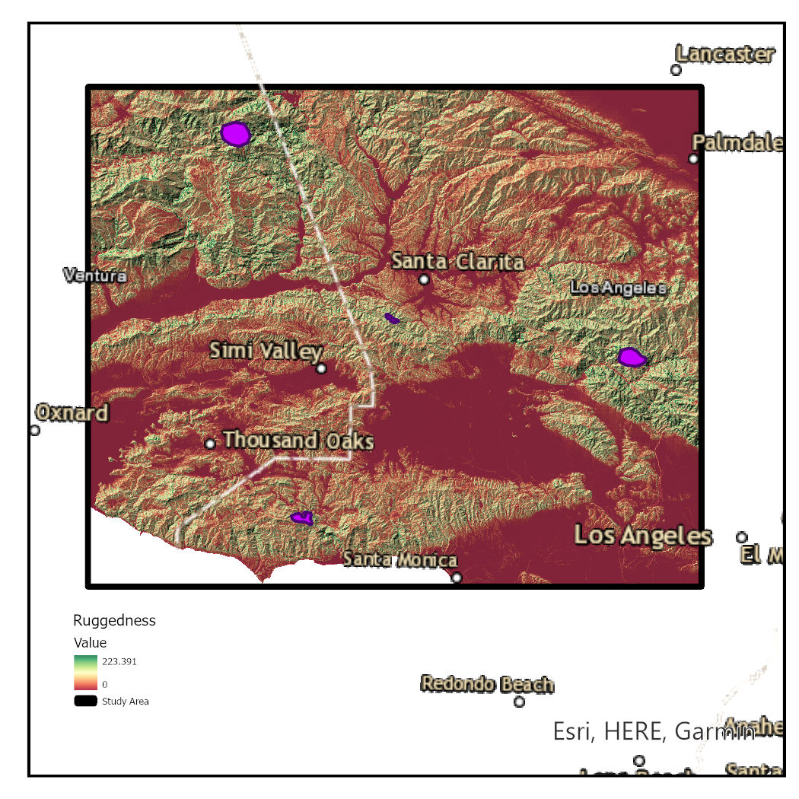

# Wildlife Habitat Assessment
# Using GIS to Design Effective Wildlife Corridors for Mountain Lions in Southern California

## Overview

This project aims to address the issue of habitat fragmentation for mountain lions (\textit{Puma concolor}) in Southern California. By employing Geographic Information Systems (GIS) and integrating various spatial datasets, the project identifies optimal wildlife corridors to ensure connectivity between fragmented habitats. The study highlights the importance of rugged terrain, protected areas, and strategic conservation efforts in maintaining genetic diversity, resource access, and population stability for mountain lions.

## Table of Contents

- [Introduction](#introduction)
- [Data Collection](#data-collection)
- [Software and Tools](#software-and-tools)
- [Preprocessing Steps](#preprocessing-steps)
- [Model Creation](#model-creation)
- [Analysis](#analysis)
- [Results](#results)
- [Discussion](#discussion)
- [Conclusion](#conclusion)
- [References](#references)
- [How to Use This Repository](#how-to-use-this-repository)

## Introduction

Urban development and infrastructure expansion are major drivers of habitat fragmentation, posing severe threats to wildlife populations. This project focuses on designing effective wildlife corridors for mountain lions in Southern California using GIS technology. The corridors facilitate movement between fragmented habitats, reducing the risks of inbreeding and local extinctions by maintaining genetic diversity and access to resources.

## Data Collection

The datasets used in this project include:

- **Elevation Layer**: Provides detailed terrain representation. Sourced from USGS's 3DEP Elevation data.
- **Roads Layer**: Analyzes proximity and impact of roads on mountain lion movement. Sourced from the U.S. Census Bureau's TIGER/Line Geodatabase.
- **Land Cover Layer**: Categorizes the land into different types, essential for understanding habitat preferences. Obtained from MRLC's National Land Cover Database.
- **Protected Status Layer**: Identifies protected areas critical for conserving wildlife habitats. Derived from USGS's Protected Areas Database.
- **Study Area Layer**: Defines the geographical boundaries of the study area. Created by Esri staff.
- **Core Mountain Lion Habitats Layer**: Identifies core habitats critical for mountain lion conservation. Created by Esri staff.
- **Topographic and Imagery Hybrid Maps**: Additional map sources from Esri, HERE, Garmin, FAO, NOAA, USGS, Intermap, METI, OpenStreetMap contributors, and the GIS User Community.

## Software and Tools

The project utilizes ArcGIS Pro version 3.3 for all geoprocessing and analysis. Key tools used include:

- Focal Statistics
- Distance Accumulation
- Rescale By Function
- Reclassify
- Optimal Region Connections

## Preprocessing Steps

- Reprojected all spatial datasets to the same coordinate system (WGS 84).
- Resampled elevation data to a 30m resolution to match the land cover dataset.
- Corrected any missing or erroneous data based on the most recent available sources.

## Model Creation

Developed a geoprocessing model in ArcGIS Pro to integrate datasets and identify optimal wildlife corridors. Key steps include:

1. **Ruggedness Layer Creation**: Using Focal Statistics on the Elevation layer.
2. **Distance to Roads Calculation**: Using the Distance Accumulation tool.
3. **Land Cover Transformation**: Reclassifying land cover types.
4. **Protected Status Transformation**: Reclassifying protection levels.

## Analysis

Combined the individual layers into a single cost surface using the Weighted Sum tool. Weights were assigned based on the relative importance of each criterion:

- Ruggedness: 1.25
- Distance to Roads: 1.00
- Land Cover: 1.25
- Protected Status: 1.00

## Results

### Ruggedness Analysis

The ruggedness layer highlights areas with significant elevation changes, providing lower cost areas for mountain lion movement due to reduced stress and danger.

### Distance to Roads

Identified that core habitats are situated in less disturbed regions, emphasizing the need for maintaining these areas as refuges.

### Land Cover

Mountain lions prefer forested and shrubland areas with lower movement costs.

### Protected Status

The analysis shows that many optimal paths pass through unprotected areas, presenting opportunities for policy interventions.

### Weighted Cost Surface

Shows that low and medium cost areas are primarily in mountainous regions, with core habitats in low-cost areas.

### Least-Cost Paths

Optimal paths connect the core habitats through the lowest cost areas.

### Key Findings

- Rugged Terrain: Preferred for lower movement costs.
- Impact of Roads: Highlighting the need for wildlife overpasses.
- Importance of Land Cover: Emphasizing habitat preservation.
- Protected Status: Opportunities for increasing protected areas.

## Discussion

### Effectiveness of GIS in Wildlife Corridor Design

The integration of multiple datasets into a GIS model demonstrates the power of GIS in wildlife conservation.

### Conservation Implications

Key conservation actions include expanding protected areas, constructing wildlife overpasses, and restoring degraded habitats.

### Future Research and Applications

Future research should explore additional factors like climate change projections, water availability, and human-wildlife conflict areas.

## Conclusion

This study demonstrates the effectiveness of GIS in designing wildlife corridors for mountain lions in Southern California. The identified least-cost paths provide a practical blueprint for developing corridors that facilitate genetic exchange, resource access, and population stability.

## References

Refer to the full list of references included in the article.

## How to Use This Repository

1. **Clone the Repository**: `git clone https://github.com/yourusername/Wildlife-Habitat-Assessment-.git`
2. **Navigate to the Directory**: `cd Wildlife-Habitat-Assessment-`
3. **Open in ArcGIS Pro**: Load the project file in `Mountain_Lion_Corridors` to view and manipulate the data.
4. **Run the Model**: Follow the steps outlined in the Methods section to run the geoprocessing model and replicate the analysis.
5. **Explore the Results**: Examine the generated maps and figures to understand the identified wildlife corridors.

Feel free to contribute to the project by opening issues or submitting pull requests. For any questions or support, contact the corresponding author at brahimtaoufyq@gmail.com.
